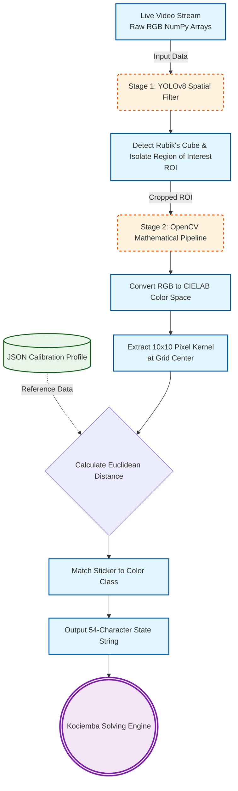

```mermaid
graph TD
    %% 定義節點
    A[Live Video Stream <br> Raw RGB NumPy Arrays] -->|Input Data| B(Stage 1: YOLOv8 Spatial Filter)
    B --> C[Detect Rubik's Cube & <br> Isolate Region of Interest ROI]
    C -->|Cropped ROI| D(Stage 2: OpenCV Mathematical Pipeline)
    D --> E[Convert RGB to CIELAB Color Space]
    E --> F[Extract 10x10 Pixel Kernel <br> at Grid Center]
    
    %% JSON 基準資料庫與計算
    H[(JSON Calibration Profile)] -.->|Reference Data| G
    
    F --> G{Calculate Euclidean Distance}
    G --> I[Match Sticker to Color Class]
    I --> J[Output 54-Character State String]
    J --> K(((Kociemba Solving Engine)))

    %% 樣式美化
    classDef process fill:#e1f5fe,stroke:#01579b,stroke-width:2px;
    classDef stage fill:#fff3e0,stroke:#e65100,stroke-width:2px,stroke-dasharray: 5 5;
    classDef database fill:#e8f5e9,stroke:#1b5e20,stroke-width:2px;
    classDef engine fill:#f3e5f5,stroke:#7b1fa2,stroke-width:3px;
    
    %% 套用樣式
    class A,C,E,F,I,J process;
    class B,D stage;
    class H database;
    class K engine;
```
